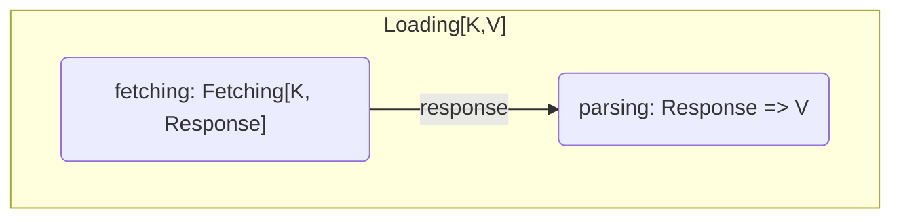

# etag-caching
_Only fetch what's needed, only parse what you don't already have_

[](https://index.scala-lang.org/guardian/etag-caching/core)
[](https://index.scala-lang.org/guardian/etag-caching/aws-s3-sdk-v2)
[](https://github.com/guardian/etag-caching/actions/workflows/ci.yml)

Many services (eg Amazon S3) include the [`ETag`](https://developer.mozilla.org/en-US/docs/Web/HTTP/Headers/ETag)s HTTP response header
in their replies - the ETag is a service-generated hash of the content requested.
If the client retains the ETag, they can send it in a [`If-None-Match`](https://developer.mozilla.org/en-US/docs/Web/HTTP/Headers/If-None-Match) HTTP request header in subsequent requests - if the service knows
the content still has the same ETag, the content hasn't changed, and the service will respond with a blank 
HTTP [`304 Not Modified`](https://developer.mozilla.org/en-US/docs/Web/HTTP/Status/304) status code - no body will be returned, as the
service knows you already have the content - this saves network bandwidth, and as there's no new content-parsing required for the client,
the client will have lower CPU requirements as well!

To make use of this as a client, you need an `ETagCache` - one where the latest ETags are stored. Although the cache could simply be storing the raw
content sent by the service, for an in-memory cache it's usually optimal to store a _parsed_ representation of the data - to save having
to parse the data multiple times. Consequently, `ETagCache` has a `Loader` that holds the two concerns of *fetching* & *parsing*.

### Usage

The main API entry point is the `com.gu.etagcaching.ETagCache` class.

#### Examples

* https://github.com/guardian/frontend/pull/26338
* https://github.com/guardian/facia-scala-client/pull/287

This example (taken from [`S3ObjectFetchingTest`](https://github.com/guardian/etag-caching/blob/main/aws-s3/aws-sdk-v2/src/test/scala/com/gu/etagcaching/aws/sdkv2/s3/S3ObjectFetchingTest.scala))
shows an `ETagCache` setup for fetching-and-parsing compressed XML from S3:

```scala
import com.gu.etagcaching.ETagCache
import com.gu.etagcaching.aws.s3.ObjectId
import com.gu.etagcaching.aws.sdkv2.s3.S3ObjectFetching
import com.gu.etagcaching.aws.sdkv2.s3.response.Transformer.Bytes
import software.amazon.awssdk.services.s3.S3AsyncClient
import scala.util.Using

val s3Client: S3AsyncClient = ???
def parseFruit(is: InputStream): Fruit = ???

val fruitCache = new ETagCache[ObjectId, Fruit](
  S3ObjectFetching(s3Client, Bytes).thenParsing {
    bytes => Using(new GZIPInputStream(bytes.asInputStream()))(parseFruit).get
  },
  AlwaysWaitForRefreshedValue,
  _.maximumSize(500).expireAfterAccess(1.hour)
)

fruitCache.get(exampleS3id) // Future[Fruit]
```

### Loading = Fetching + Parsing


